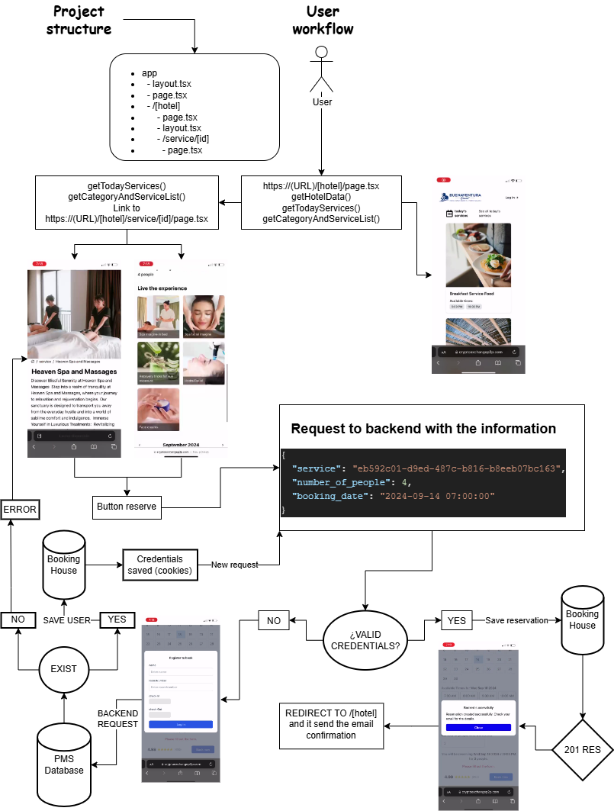

# Home page view


This is a [Next.js](https://nextjs.org) project bootstrapped with [`create-next-app`](https://nextjs.org/docs/app/api-reference/cli/create-next-app).

## Getting Started

First, run the development server:

```bash
npm run dev
# or
yarn dev
# or
pnpm dev
# or
bun dev
```

Open [http://localhost:3000](http://localhost:3000) with your browser to see the result.

## View the [Booking House Backend](https://github.com/Alberto200420/bookingHouse/tree/mvp)

## Front end logic structure workflow:


## About Booking House project

**Booking House** is a project that allows hotel guests to access a catalog of services via their smartphones. Guests can explore activities, services, and tours offered by the hotel where they are staying.

The application supports a multi-hotel management system, enabling a hotel corporation or an owner of multiple hotels to register hotels, manage categories, and offer services dynamically. Each hotel gets a unique, dynamically generated URL for guests to access.

For example, the Buenaventura hotel corporation can register its hotels: "Buenaventura," "Hacienda Buenaventura," and "Villa Premier." The system saves these in the database along with the hotel logo and creates a unique URL for each hotel:

- `https://[DOMAIN]/buenaventura/`
- `https://[DOMAIN]/haciendabuenaventura/`
- `https://[DOMAIN]/villapremier/`

## Key Features

- **Multi-hotel management**: Register and manage multiple hotels under a single account.
- **Easy booking for a guests**: Guests can see the services and see the full content of these (images, description, menu, if it need a reservation) and at the time of booking it is a simple log in then rebook and (a confirmation email must be sent which this MVP does not do).
- **Service catalog**: Guests can browse through services, activities, and tours available at the hotel.

## Dynamic URL Structure

Each hotel will have its own dynamically generated URL:

- `https://[DOMAIN]/[REGISTERED HOTEL]/`


This ensures that each hotel has its own unique service catalog and offerings, accessible by its guests.

### This branch is just the MVP of the aplication 